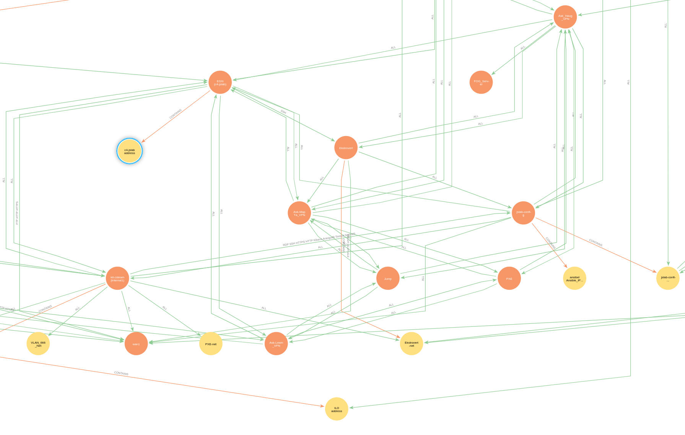

Introduction to Graph Database Visualization of Zones & Conduites in Neo4j

Graph databases provide a powerful way to represent and visualize complex relationships between data entities. In the context of IEC62443, which focuses on industrial cybersecurity, zones and conduits play a crucial role in understanding the network architecture and potential vulnerabilities.

By leveraging Neo4j, a popular graph database, we can create a visual representation of zones and conduits based on data stored in a CSV file. This allows us to easily explore and analyze the relationships between different zones and conduits, enabling better understanding and decision-making in the realm of industrial cybersecurity.

# Access to the neo4j VM QuickStart
- Connect your FortiVPN Client
- RDP to 10.0.1.101 (or jslab-neo4j.cs.lab when I get the DNS record added)
- Use "csteam" as user
- Open Files and double click 'neo4j-desktop-1.6.0-x86_64.AppImage'
- Start the database "AibelFirewall"

# All the preparations done ahead of this

Let's try to 
1. setup a neo4j database
2. make a local database called AibelFirewall
3. populate the database with nodes and relations from the ZaC-ABB-WithSL-T.csv

# Setup the neo4j database
- Creating a new virtual machine based on the Ubuntu Desktop Template image. Had to upgrade it first.
- named cslab-neo4j.cs.lab @ 10.0.1.101
- User: csteam (password in Teams base)
- Also created another VLAN in the LAB called jslab-DB with ID 405
    - Since this must be done on both the firewall, the switches and esxi hosts, I've started automating this with Ansible. (ansible.cs.lab)
- Register at https://neo4j.com/download/ to get access to Neo4j Desktop
- Download and move it to your home folder.
- Give the file execution rights

    chmod +x "name-on-the-downloaded-file"

- Start Neo4j from the File Browser by double clicking it. Takes a little while to get started.
- Create a new project.
- In this project -> create a local database: AibelFirewall
- Open Neo4j Bloom and search with the default "Show me a graph". Should be empty for now.

## Let's get the data pulled from github repository
In the ~home~/GIT folder of jslab-neo4j server:

Authenticate your GIT session:

```bash
    gh auth login
```

    Follow the prompts:
    - Select `GitHub.com`
    - Choose `HTTPS` for Git operations
    - Authenticate with GitHub credentials
    - Select `Login with a web browser`
    - Copy the one-time code and authenticate in your browser

```bash
    git clone https://github.com/Aibel-OT-Cybersecurity/zonesAndConduites.git
```

This will create a GIT controlled folder "zonesAndConduites" in your /home/csteam/GIT folder. The Python script and our CSV-file is under the folder ZonesAndConduites.

Also do this on your own laptop and edit the files locally there. Use Microsoft VS Code with GIT to push all changes to Github from there, and use git pull on the neo4j-server.

## Setup Python
Check that Python is installed on the server:

    python3 --version

Create a virtual environment:

    python3 -m venv .venv

Activate the virtual environment:

    source .venv/bin/activate

Install the Neo4j driver:

    pip install neo4j

Now you're ready to run the aibelFirewall.py script to generate the graph:

    python3 ./aibelFirewall.py

This will read the ZaC-ABB-WithSL-T.csv and create a graph in Neo4j. It's pretty quick.

# Neo4j operations
Open the Neo4j Bloom and do the "Show me a graph" again. Should now show something that looks a bit like ABB 800xA control system. (Still some mistakes to be fixed.)

## Coloring the nodes based on SL-T
- At the left side, select the Nodes tab, then click on the colored circle next to "Node".
- Select Rule-based
- Click Add rule-based styling
- Select label -> label (Unique values)
- Apply color (haven't figured out how to pick my own colors yet)
- The nodes should now have colors based on the SL-T in "label".

## Have description on hover
- Click the Node circle again
- Deafult
- Text
- description > Show on hover
- name > Show on node

Looks like I forgot to include Description in my script... Feel free to fix it :)

## Get "service" as text on the conduites
- Click on Relationships top left
- Click on the line before CONNECTS
- Click on Text
- ports > Show on hover
- service > Show on relationship

# Cytoscape.js Web Visualization

In addition to Neo4j Bloom, the ZaC graph can be explored in a browser-based visualization built with [Cytoscape.js](https://js.cytoscape.org/). Nodes are colour-coded by Purdue level (the `label` property on each node), making it easy to see cross-level conduits at a glance.

## Files

| File | Purpose |
|---|---|
| `viz_server.py` | Python HTTP server — queries Neo4j `zac` and serves the graph as JSON at `/graph`, and the HTML page at `/`. |
| `cytoscape_viz.html` | Cytoscape.js frontend — fetches `/graph` and renders the interactive visualization. |

## Purdue level colour coding

| Level | Colour | Description |
|---|---|---|
| 0 | 🔴 Dark red | Field / Process |
| 1 | 🟠 Orange | Basic Control |
| 2 | 🟡 Amber | Supervisory Control |
| 2.5 | 🟢 Light green | Industrial DMZ |
| 3 | 🩵 Teal | Site Operations |
| 3.5 | 🔵 Light blue | Site DMZ |
| 4 | 🟣 Indigo | Business Planning |
| 5 | 🟣 Purple | Enterprise / Remote |

## How to run

Make sure the `neo4j` Python driver is installed (see **Setup Python** above) and that Neo4j is running with the `zac` database populated by `test.py`.

Activate the virtual environment if you are using one:

    source .venv/bin/activate

Start the server:

    python3 viz_server.py

Then open your browser at:

    http://localhost:8765

Press **Ctrl+C** in the terminal to stop the server.

## Features

- **Concentric default layout** — level 0 in the centre, level 5 on the outer ring, reflecting the Purdue model hierarchy.
- **Hover tooltips** — hover a node to see its name and Purdue level; hover an edge to see the conduit ID, ports, and service.
- **Click a node** to highlight all its connected conduits (edges) in yellow.
- **Layout switcher** — switch between CoSE (force-directed), breadth-first, circle, grid, and concentric layouts.
- **Fit button** — re-centers and zooms the view to show all nodes.

# Create a graph based on a Fortigate policy JSON export
The Fortigate can export it's policy set as CSV, JSON or as a complete backup of the whole system. Let's say we export to JSON and want to analyze it as a graph.

The format of the JSON looks like this:

    [
        {
            "Name": "kit 2 outside",
            "From": "kit-csteam (internal1)",
            "To": "wan1",
            "Source": "all",
            "Destination": "all",
            "Schedule": "always",
            "Service": "ALL",
            "Action": "ACCEPT",
            "NAT": "Enabled",
            "Security Profiles": "no-inspection",
            "Log": "UTM",
            "Bytes": "85.60 GB",
            "Type": "Standard"
        },
        {
            "Name": "kit 2 jslab",
            "From": "kit-csteam (internal1)",
            "To": "ESXi (c4-jslab)",
            "Source": "all",
            "Destination": "all",
            "Schedule": "always",
            "Service": "ALL",
            "Action": "ACCEPT",
            "NAT": "Enabled",
            "Security Profiles": "no-inspection",
            "Log": "UTM",
            "Bytes": "41.77 GB",
            "Type": "Standard"
        },
    ]

We need to access the data from the graph database, in this case Neo4j, by queries. The graph is looking like this:


- The orange nodes are labeled as Zone since they are the interfaces of the firewall. This includes VLANs.
- The yellow nodes are labeled as NetworkDevice since they are either a network or a device.
- The orange Zone nodes have the relation CONTAINS to the yellow NetworkDevice nodes.
- We also have a relation named CONDUIT which is the actual firewall rule or Policy.

The policy rule import script is called ./AibelFortigateIn.py

The policy rule export script is called [./AibelFortigateOut.py](https://github.com/AibelCS/Documentation/tree/main/zonesAndConduites/AibelFortigateOut.py)

When we export, we would like to follow some standards:
1. don't have multiple interfaces in the same policy (and we don't want it activated on the Fortiate either)
2. Group interfaces using Fortigate Zones. That's what it's for!
3. Always make explicit policies with a Source and a Destination. 
4. Address objects should be created for all devices, and grouped if necessary. (difficult in this graph model, since we first have to import it)
5. Make consistant "source"-to-"destination" naming

To avoid recreating nodes from the Zone as a source or destination (ref 3), we query for yellow NetworkDevice nodes and then lookup the relation to the Zone nodes. Seems like this Cypher query does exactly that:

    MATCH (source:NetworkDevice)<-[:CONTAINS]-(from:Zone)
    MATCH (destination:NetworkDevice)<-[:CONTAINS]-(to:Zone)
    MATCH (from)-[r:CONDUIT]->(to)
    RETURN from, r, to, source, destination

Look at the arrows pointing in the "wrong" direction. I read it as a "has parent" reference.

Since we're manipulating data both with code and graph relations (edges), we can easily fix the bad ALL/ALL/ANY rules by either skip them, or explicitly force Source and Destination (network or device address) to be used instead of From and To (interface).


